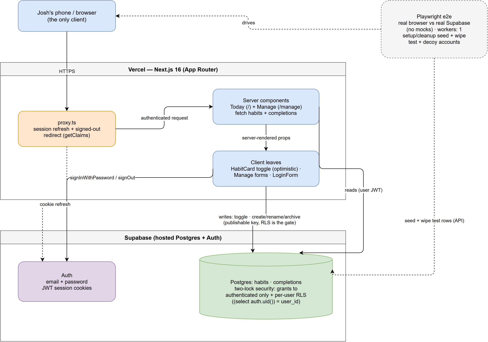

# Architecture Brief — gamify-life v2 (loop one)

*Current-state truth as of 2026-09-11. One page. The picture:*

*(source: `architecture.drawio` — re-export with:
`draw.io.exe -x -f png -e -s 2 -o docs/architecture.drawio.png docs/architecture.drawio`)*

## The three pieces

1. **The phone/browser** — the only client. Opens one URL, keeps a session
   cookie, taps habits.
2. **The Next.js 16 app (on Vercel)** — renders the two screens (Today `/`,
   Manage `/manage`) and the sign-in screen. No database of its own; it talks
   to Supabase on every request.
3. **Supabase** — hosted Postgres (`habits`, `completions` tables) plus Auth
   (email + password, JWT session cookies). The only place data lives.

Every habit carries a **kind** (issues #9/#13, born from real use): `task`
(done once — completing archives it into the existing archive flow, with an
un-tap grace window before the next load), `daily` (repeats every day; the
checkbox means *done today* and the weekly number is an adjustable quota
rendered as quiet progress), `weekly` (genuinely N-per-week; once the target
is met on an earlier day the card rests — dimmed, untappable, out of the
day's ops count — until the device-local Monday). A tap can also be
**backdated** (#10): a secondary control logs "done on" one of the past 7
days through the same device-dated write path as a plain tap. For a task
already completed today, backdating is a correction, not another completion:
the existing today row moves to the picked day (issue #16), while dailies and
weeklies keep the per-day insert behavior.

## How a request flows

Every request first passes `proxy.ts` (Next 16's rename of middleware): it
refreshes the Supabase session cookie and bounces signed-out visitors to
`/login`. Gotcha: any route the browser fetches *without* being signed in
(e.g. `/manifest.webmanifest` during home-screen install) must be excluded
in the matcher, or unauthenticated fetches get the login page instead. Then the **server component** for the page re-checks auth
(`requireUserId` — belt and braces, in case the proxy matcher ever drifts) and
fetches that user's rows. The page ships to the browser with small **client
leaves** for anything interactive: the habit-card tap, the Manage forms, the
login form.

**Reads happen on the server. Writes happen in the browser** — a tap inserts
or deletes a completion row directly against Supabase, optimistically (UI
flips instantly, reverts with a visible error if the write fails), then
`router.refresh()` re-syncs server truth.

## Why that's safe (the two-lock model)

The browser holds only the **publishable key** — it's meant to be public. What
actually protects data is in Postgres itself, two locks deep:

- **Grants:** only the `authenticated` role can touch the tables at all;
  `anon` has nothing.
- **Row Level Security:** every policy checks `(select auth.uid()) = user_id`
  — you can only ever see or change your own rows. Completions inserts
  additionally verify you own the habit being completed.

So even someone hitting the Supabase REST API directly with the public key
gets nothing without a valid session, and only their own rows with one. Both
locks ship in the same migration as each table (`supabase/migrations/`) —
never "open now, lock later."

## One deliberate subtlety: the local day

The device's clock is the **only** clock that interprets a calendar day — on
the write path *and* the read path. `completed_on` is a plain date computed
from the device's local clock at tap time (`lib/dates.ts`, pure functions) —
an 11:50pm tap counts for today, not tomorrow-in-UTC. Weeks start Monday.
On read, the server never computes "today" (its clock is UTC and can sit a
calendar day off the device — issue #8, where an evening tap unchecked
itself on refresh): it ships a padded window of raw completion dates
(`getCompletionsFetchFloor` + a matching ceiling, issue #13) and the client
derives today/week after hydration (`today-completions.tsx`). The weekly
count's upper bound is **today, not Sunday** — a row dated later in the
current week can never read as already done. Guards: the near-midnight unit tests run
pinned west-of-UTC so the trap case can never silently skip, and
`npm run test:e2e:tzskew` boots the dev server on a clock a full calendar day
off the browser's (`playwright.tzskew.config.ts` + `e2e/tz-skew.cjs`) and
re-runs the completions persist spec, so the dual-clock bug class stays
unrepresentable.

## How we know it works

- **Playwright e2e** drives a real browser against the real hosted Supabase —
  no mocks, because a mock would skip RLS, the exact thing under test. A
  dedicated test account (plus a decoy account that proves cross-user
  isolation) is seeded and wiped every run. One worker, so runs can't race.
- **Pure unit tests** cover the date math.
- Lint + build gate every change; every ticket's commit message quotes its
  verification evidence.
